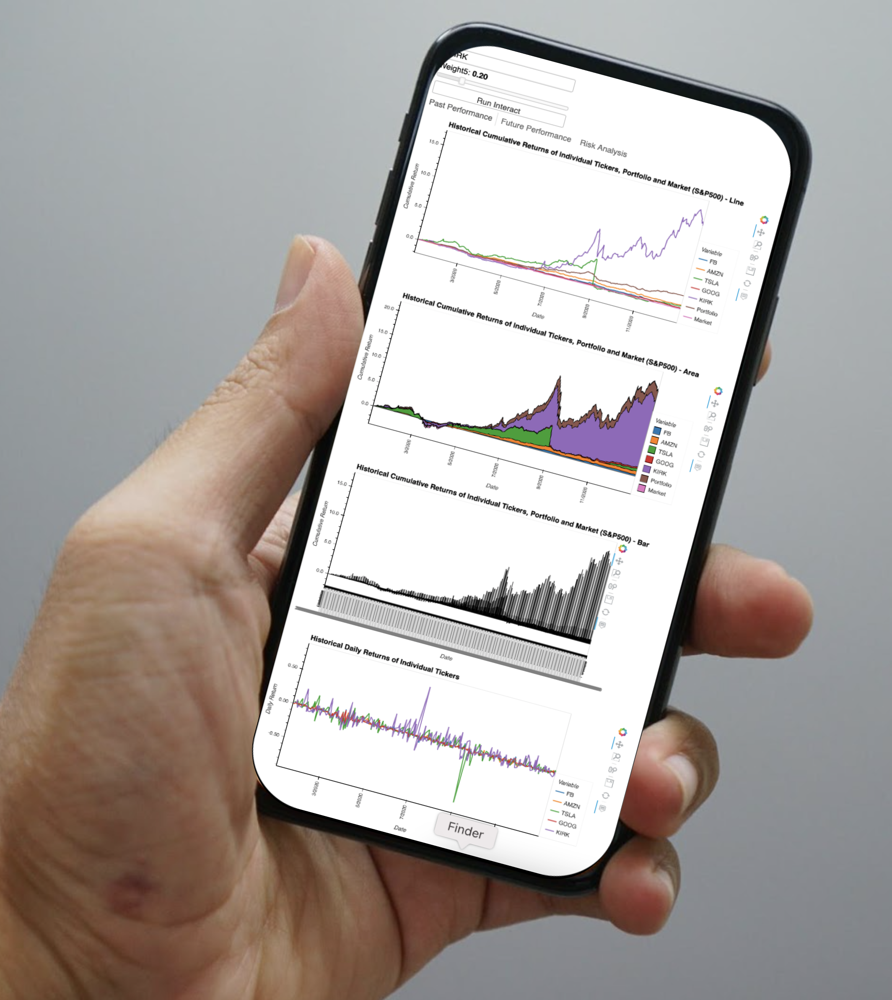
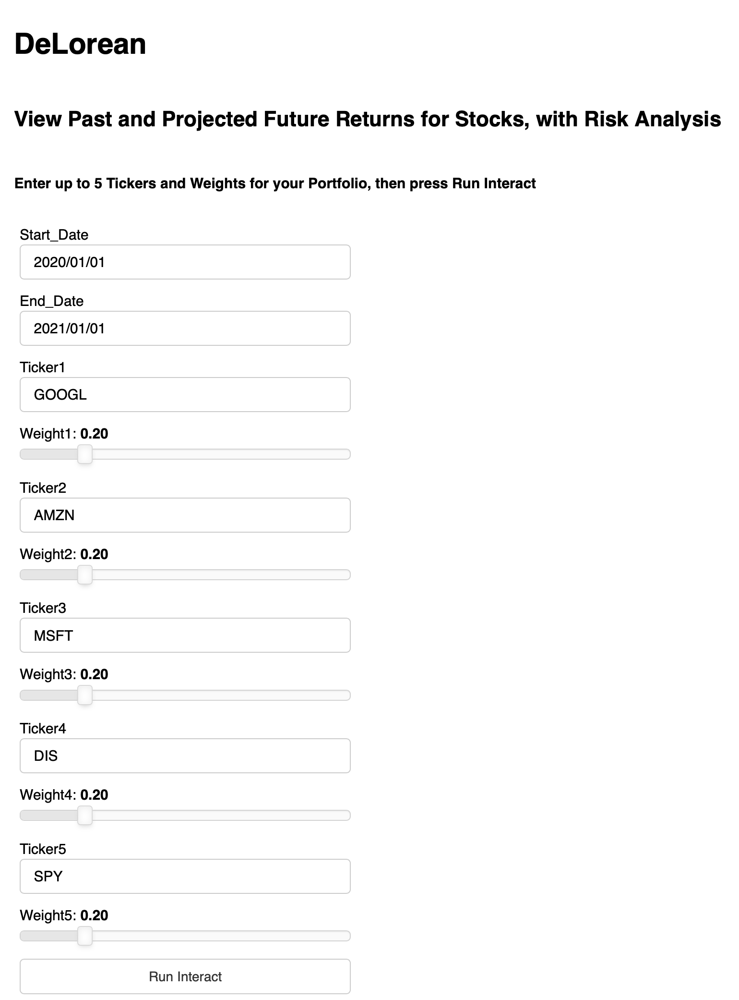
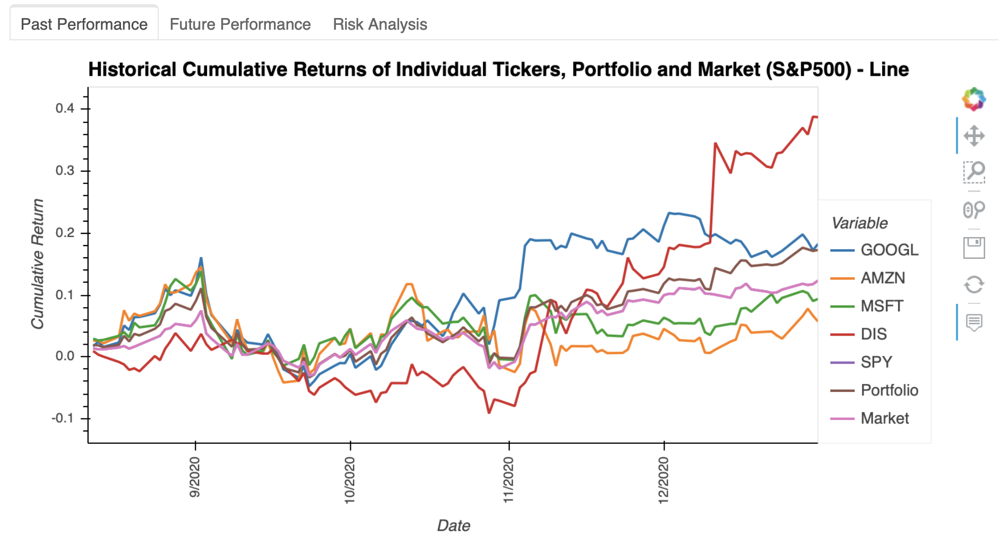

# DeLorean - Financial Analysis Tool
**View Past and Projected Future Returns for Stocks, with Risk Analysis**

## How to Run the App
Open and run all cells in `main.ipynb`

## User Input

- Start date
- End date
- Up to 5 tickers and their weights in the investment portfolio (must sum to 1)

## APP Output

- Historical cumulative returns of selected stocks, combined portfolio and the market (S&P500) 
- Predicted future performance of the investment portfolio - Monte Carlo simulation
- Risk Analysis of selected stocks, including box plot, correlation heat map, and line plot of rolling standard deviation of each ticker's daily returns in a 21 days window

## Libraries Used
`datetime`, `pytz`, `python-dotenv`, `alpaca-trade-api`, `panel`, `pandas`, `numpy`, `nodejs`, `hvPlot`, `flask`, `flask_wtf`, `wtforms`

## API Used
- Alpaca
- Yahoo Finance 